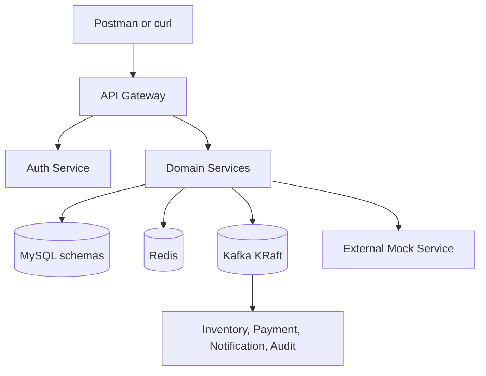
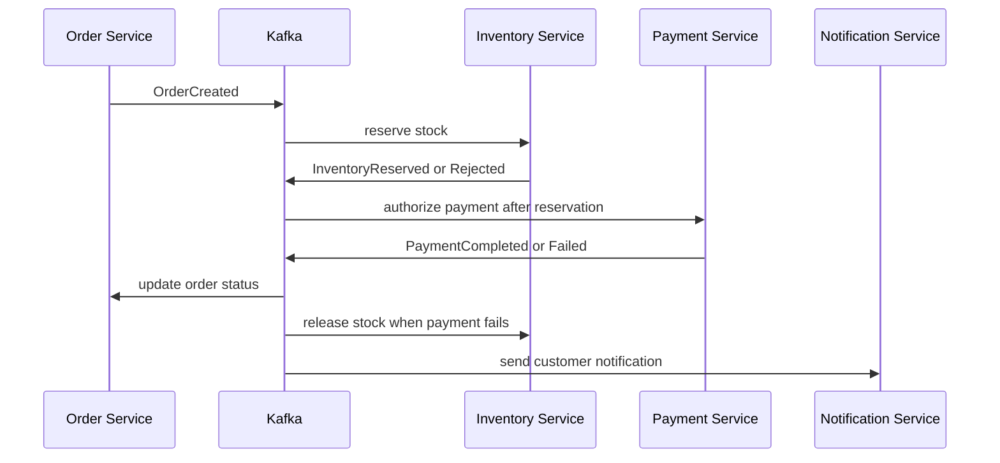

# Architecture

Detailed deployment views:

- [Local Docker Desktop Kubernetes](architecture-local.md)
- [Temporary AWS EKS sandbox](architecture-cloud.md)

## Logical component view



`Domain Services` represents the ten database-owning business services;
inventory, payment, notification and audit also participate in asynchronous
flows. Each deploys independently even though the code is in one repository.

## Security flow

1. Client calls `POST /api/v1/auth/login` through the gateway.
2. Gateway routes the unauthenticated login request to `auth-service`.
3. `auth-service` validates a BCrypt password and signs an access token with an RSA private key.
4. The access token contains the user UUID in `sub`, plus `username`, `roles`,
   `aud`, `iat`, `exp` and `iss` claims.
5. Gateway validates signature, issuer and expiry using the public key.
6. Each downstream service independently validates the same JWT. Gateway validation is not the only security boundary.
7. Method/route authorization enforces roles.

## Synchronous request flow

Example product search:

```text
Client
  -> Gateway correlation/security/rate-limit filters
  -> Product controller
  -> Product application service
  -> Redis cache
       hit: map and return
       miss: JPA repository -> MySQL -> populate cache -> return
  -> JSON response with X-Correlation-ID
```

Example simulated payment-provider call:

```text
Kafka InventoryReserved -> Payment Service -> External Mock Service
                                      |-> bounded connect/read timeout
                                      |-> transaction updates payment/outbox
                                      `-> Kafka PaymentCompleted/PaymentFailed
```

Prescription activation/fill is currently an authorized synchronous lifecycle;
the reserved prescription event contracts do not yet have a producer. See
`known-gaps.md`.

## Order choreography saga



The order service remains the owner of order status. Inventory and payment own their local records. Compensation occurs through events, not a cross-service rollback.

## Transactional outbox

Within one local database transaction, a producing service writes:

- its aggregate change; and
- an `outbox_event` row containing event metadata and payload.

A scheduled publisher locks/polls unpublished rows, publishes them to Kafka and marks them published. Delivery can still be repeated, so every consumer also stores the `eventId` in a `processed_event` table with a unique constraint.

## Failure boundaries

| Failure | Expected behavior |
|---|---|
| Product cache unavailable | Fall back to MySQL; emit cache error metric |
| Simulated payment or notification provider slow | Bounded timeout; surface/record a controlled failure without inventing success |
| Kafka unavailable during business transaction | Business change and outbox row commit; publisher retries later |
| Duplicate Kafka event | Consumer detects `eventId`; acknowledges without repeating side effect |
| Inventory unavailable | Order remains pending until retry/DLT policy resolves; alert on lag/DLT |
| Payment failed | PaymentFailed event; inventory released; order cancelled |
| Notification failed | Core order remains successful; notification retries then DLT |
| MySQL unavailable | Readiness becomes unhealthy; API returns sanitized 503/500 problem response |

## Deployment views

### Local Compose (legacy alternative)

The original self-run path used Docker Compose for all applications and backing
services. It remains available for development but is not the full Kubernetes
deployment path; do not run it against the same backing data simultaneously.

### Local Kubernetes

- Namespace: `pharmacy`
- Deployments and ClusterIP Services for applications
- ConfigMaps for non-sensitive configuration
- Secrets for local demonstration credentials
- Port-forward access to the API Gateway; no public local Ingress
- MySQL and Kafka run on the host, reachable from pods via Docker Desktop host
  networking; Redis and the external mock run in the cluster
- Local observability is installed separately, not scraped from Compose DNS
- Resource requests/limits and startup/readiness/liveness probes on every application

### Temporary AWS mapping

| Local | AWS learning equivalent |
|---|---|
| Docker registry | ECR |
| Local Kubernetes | EKS |
| Host-native MySQL | RDS MySQL (separate schema/user per service) |
| Host-native Kafka | Disposable private single-broker Kafka in EKS (not MSK) |
| Gateway port-forward | EKS API-backed `kubectl port-forward` (default) |
| Optional ingress | AWS Load Balancer Controller with HTTPS-only, `/32`-restricted ALB |
| Local secrets | Secrets Manager |
| Metrics/logs/traces | Private in-cluster Prometheus, Grafana, Loki, Tempo, Alloy and OpenTelemetry Collector; CloudWatch receives EKS control-plane logs |
| Local Terraform state | Versioned encrypted S3 backend |

The AWS full-fleet test environment is independent of local services and data.
It is created only for occasional synthetic-data testing and destroyed after
each session. Public-subnet worker nodes and a single broker are deliberate
cost-saving choices for this **non-production** sandbox, not a production
high-availability/security reference. The full-fleet AWS design is prepared
and validated offline but has not yet been deployed and verified live.
