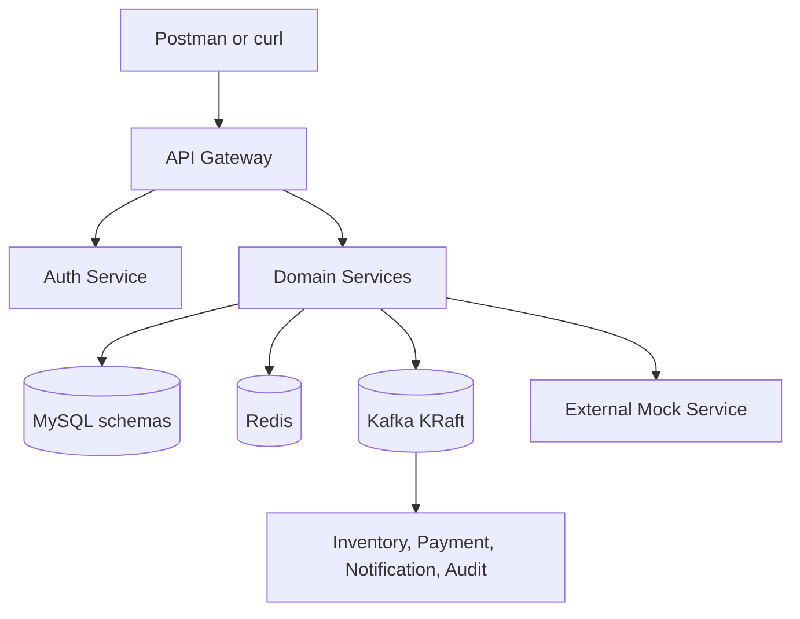
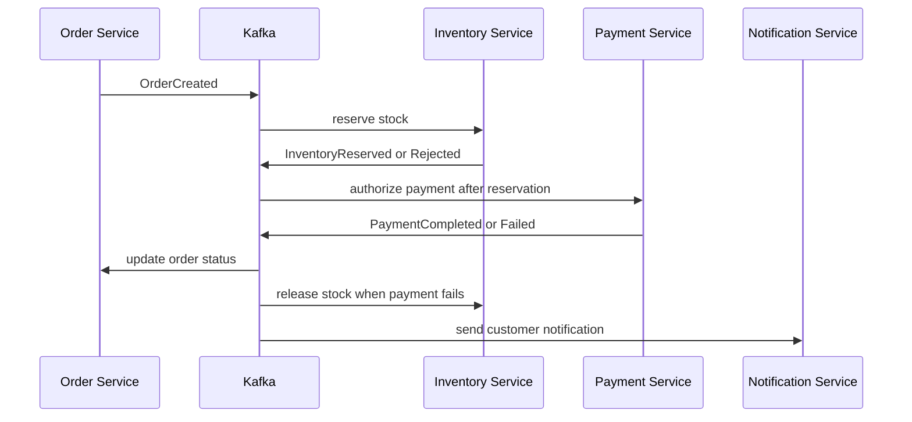

# Architecture

## Logical component view



`Domain Services` represents product, customer, pharmacy, prescription and order services. Each deploys independently even though the code is in one repository.

## Security flow

1. Client calls `POST /api/v1/auth/login` through the gateway.
2. Gateway routes the unauthenticated login request to `auth-service`.
3. `auth-service` validates a BCrypt password and signs an access token with an RSA private key.
4. The access token contains `sub`, `userId`, `roles`, `iat`, `exp`, `iss` and `jti` claims.
5. Gateway validates signature, issuer and expiry using the public key.
6. Each downstream service independently validates the same JWT. Gateway validation is not the only security boundary.
7. Method/route authorization enforces roles.

## Synchronous request flow

Example product search:

```text
Client
  -> Gateway correlation/security/rate-limit filters
  -> Product controller
  -> Product application service
  -> Redis cache
       hit: map and return
       miss: JPA repository -> MySQL -> populate cache -> return
  -> JSON response with X-Correlation-ID
```

Example prescription verification:

```text
Client -> Gateway -> Prescription Service -> External Mock Service
                                   |-> timeout/retry/circuit breaker
                                   |-> transaction updates status/outbox
                                   `-> Kafka PrescriptionVerified/Rejected
```

## Order choreography saga



The order service remains the owner of order status. Inventory and payment own their local records. Compensation occurs through events, not a cross-service rollback.

## Transactional outbox

Within one local database transaction, a producing service writes:

- its aggregate change; and
- an `outbox_event` row containing event metadata and payload.

A scheduled publisher locks/polls unpublished rows, publishes them to Kafka and marks them published. Delivery can still be repeated, so every consumer also stores the `eventId` in a `processed_event` table with a unique constraint.

## Failure boundaries

| Failure | Expected behavior |
|---|---|
| Product cache unavailable | Fall back to MySQL; emit cache error metric |
| External verification slow | Timeout; bounded retry only when safe; circuit opens; return controlled pending/failure state |
| Kafka unavailable during business transaction | Business change and outbox row commit; publisher retries later |
| Duplicate Kafka event | Consumer detects `eventId`; acknowledges without repeating side effect |
| Inventory unavailable | Order remains pending until retry/DLT policy resolves; alert on lag/DLT |
| Payment failed | PaymentFailed event; inventory released; order cancelled |
| Notification failed | Core order remains successful; notification retries then DLT |
| MySQL unavailable | Readiness becomes unhealthy; API returns sanitized 503/500 problem response |

## Deployment views

### Local Compose

All services plus MySQL, Redis, Kafka, Prometheus, Grafana, OpenTelemetry Collector and optional log tooling share a Docker network. Host ports are exposed only for learning and testing.

### Local Kubernetes

- Namespace: `pharmacy`
- Deployments and ClusterIP Services for applications
- ConfigMaps for non-sensitive configuration
- Secrets for local demonstration credentials
- Ingress for the API Gateway only
- Stateful infrastructure may use Helm dependencies or remain outside the cluster during early learning
- Resource requests/limits and startup/readiness/liveness probes on every application

### Temporary AWS mapping

| Local | AWS learning equivalent |
|---|---|
| Docker registry | ECR |
| Local Kubernetes | EKS |
| MySQL | RDS MySQL/Aurora MySQL |
| Ingress | AWS Load Balancer Controller/ALB |
| Local secrets | Secrets Manager |
| Metrics/logs | CloudWatch integration |
| Local object files | S3 |
| DNS concepts | Route 53 |

Kafka remains local for this project.

