# Cloud architecture — temporary AWS EKS sandbox

This diagram describes the repository's actual AWS learning sandbox. It is a
temporary, billable, single-replica environment—not a production reference.
The current full-fleet design is prepared and validated offline but has not yet
been deployed and verified live.

```mermaid
flowchart TB
    operator["Operator<br/>AWS SSO + kubectl"]
    privateentry["Default access<br/>kubectl port-forward"]
    internetclient["Optional test client<br/>single approved public IP"]

    subgraph aws["AWS sandbox account"]
        state["S3<br/>encrypted/versioned Terraform state"]
        ecr["ECR<br/>12 immutable service images"]
        secretsmanager["Secrets Manager<br/>10 DB credentials + JWT key material"]
        cloudwatch["CloudWatch Logs<br/>EKS control-plane logs"]
        acm["ACM certificate<br/>required only for optional ALB"]

        subgraph vpc["VPC · two Availability Zones"]
            igw["Internet Gateway<br/>no NAT Gateway"]

            subgraph publicsubnets["Two public subnets"]
                alb["Optional AWS ALB<br/>HTTPS :443 only<br/>/32 source allowlist"]

                subgraph eks["Amazon EKS · two arm64 t4g.large workers"]
                    control["Managed EKS control plane"]

                    subgraph pharmacy["Namespace: pharmacy"]
                        gateway["API Gateway<br/>ClusterIP · :8080<br/>management :9081"]
                        services["Full JVM fleet<br/>auth · product · customer · pharmacy · inventory<br/>prescription · order · payment · notification · audit"]
                        mock["External Mock Service"]
                        redis["Ephemeral Redis"]
                        kafka["Private Kafka KRaft StatefulSet<br/>single broker · 8 GiB gp3"]
                        topics["5 domain topics<br/>plus retry and DLT topics"]
                        irsa["Per-workload IRSA ServiceAccounts"]
                        tmpfs["Init containers → memory-backed files<br/>mode 0600 · no Kubernetes Secret copy"]
                        dbbootstrap["Temporary DB bootstrap Job"]
                    end

                    subgraph obs["Namespace: pharmacy-observability"]
                        prometheus["Prometheus<br/>2-day bounded retention"]
                        grafana["Grafana<br/>ClusterIP / port-forward"]
                        loki["Loki<br/>48-hour retention"]
                        tempo["Tempo<br/>48-hour retention"]
                        collector["OpenTelemetry Collector"]
                        alloy["Alloy"]
                        kafkaexporter["Kafka Exporter<br/>runs in pharmacy namespace"]
                    end
                end
            end

            subgraph privatedb["Two private RDS-only subnets<br/>no internet route"]
                rds["RDS MySQL 8.4<br/>one private instance<br/>10 isolated schemas + users"]
                rdssg["Security group<br/>MySQL :3306 from EKS only"]
            end
        end
    end

    operator --> state
    operator --> privateentry --> gateway
    internetclient -. "only when alb-https is explicitly selected" .-> alb
    acm -.-> alb
    igw -.-> alb
    alb -. "Ingress → gateway" .-> gateway

    ecr -->|"image pulls"| eks
    control --> cloudwatch
    control --- services
    gateway --> services
    services -. "internal HTTP" .-> services
    services --> redis
    services --> mock
    services -->|"outbox producers / idempotent consumers"| kafka
    kafka --- topics

    irsa -->|"scoped GetSecretValue"| secretsmanager
    secretsmanager --> tmpfs
    tmpfs --> services
    dbbootstrap -->|"master + service credentials"| secretsmanager
    dbbootstrap -->|"create schemas/users"| rds
    services -->|"JDBC per-service identity"| rds
    rds --- rdssg
    rdssg -. "source: EKS cluster security group" .-> eks

    services -. "annotated metrics" .-> prometheus
    services -. "OTLP traces" .-> collector
    collector --> tempo
    services -. "structured pod logs" .-> alloy
    alloy --> loki
    kafkaexporter -. "lag / DLT offsets" .-> kafka
    prometheus --> kafkaexporter
    grafana --> prometheus
    grafana --> loki
    grafana --> tempo

    dynatrace["Dynatrace OTLP / OneAgent<br/>optional · not installed"]
    splunk["Splunk HEC<br/>optional · not configured"]
    collector -. "explicit trial overlay only" .-> dynatrace
    alloy -. "explicit trial overlay only" .-> splunk

    classDef external fill:#f7f7f7,stroke:#555,stroke-dasharray: 5 5;
    classDef awsservice fill:#fff0d9,stroke:#a65f00;
    classDef app fill:#e8f2ff,stroke:#2463a6;
    classDef data fill:#fff4d6,stroke:#a66b00;
    classDef obs fill:#e9f8ee,stroke:#237a3b;
    classDef optional fill:#f4e9ff,stroke:#7a3db8,stroke-dasharray: 5 5;
    class operator,privateentry,internetclient external;
    class state,ecr,secretsmanager,cloudwatch,acm,igw,alb,control,irsa awsservice;
    class gateway,services,mock,tmpfs,dbbootstrap app;
    class redis,kafka,topics,rds,rdssg data;
    class prometheus,grafana,loki,tempo,collector,alloy,kafkaexporter obs;
    class dynatrace,splunk optional;
```

## Reading the diagram

- The default gateway exposure is private port-forwarding. The ALB path exists
  only when `gateway_exposure=alb-https`; it has no HTTP listener and requires
  ACM plus a `/32` ingress allowlist.
- Worker nodes use public subnets to avoid a NAT Gateway in this disposable
  learning environment. RDS is in separate private subnets with no internet
  route and accepts MySQL only from this EKS cluster.
- One RDS instance hosts ten service-owned schemas/users. This preserves
  logical ownership for the sandbox but is not physical database isolation.
- Secret values remain in Secrets Manager. IRSA-scoped init containers write
  only the current workload's values into memory-backed, mode-0600 files; they
  are not copied into committed manifests, ConfigMaps or Kubernetes Secrets.
- Redis is disposable. Kafka is a private single broker with session-scoped gp3
  storage. The observability backends use bounded ephemeral storage/retention.
- Dynatrace and Splunk are disabled Prompt 14 hooks. Enabling them requires an
  explicit approved trial and separate credentials.

## Authoritative sources

- Terraform topology: `infra/terraform/envs/sandbox/` and
  `infra/terraform/modules/`
- Rendered workload sources: `infra/k8s/sandbox/`
- Deployment and teardown scripts: `scripts/aws-*.sh`
- Security/cost review: `docs/aws-plan-review.md`
- Prepared observability profile:
  `infra/k8s/sandbox/observability-values-aws.yaml`
