# Local architecture — Docker Desktop Kubernetes

This is the canonical local deployment view. The application runs in Docker
Desktop Kubernetes; project-scoped MySQL and Kafka run natively on the host.
The legacy Compose fleet is a separate alternative and must not use the same
ports/data at the same time.

```mermaid
flowchart TB
    developer["Developer<br/>curl / Postman / browser"]
    portforward["kubectl port-forward<br/>localhost:18080 → api-gateway:8080"]

    subgraph desktop["Developer workstation / Docker Desktop"]
        subgraph hostdeps["Host-native project dependencies"]
            mysql["MySQL 8.4 · 127.0.0.1:3308<br/>10 service-owned schemas + users"]
            kafka["Kafka 4.x KRaft<br/>host: localhost:19092<br/>pods: host.docker.internal:29092"]
            kafkatopics["5 domain topics<br/>order · inventory · payment · prescription · notification<br/>plus retry and DLT topics"]
            kafka --- kafkatopics
        end

        subgraph k8s["Docker Desktop Kubernetes"]
            subgraph pharmacy["Namespace: pharmacy"]
                gateway["API Gateway<br/>WebFlux · :8080<br/>management :9081"]
                auth["Auth Service<br/>RSA JWT/JWKS · :8081"]
                product["Product Service<br/>cache-aside · :8082"]
                customer["Customer Service · :8083"]
                pharmacyservice["Pharmacy Service · :8084"]
                inventory["Inventory Service<br/>saga participant · :8085"]
                prescription["Prescription Service<br/>activation/fill lifecycle · :8086"]
                order["Order Service<br/>saga owner/outbox · :8087"]
                payment["Payment Service<br/>outbox · :8088"]
                notification["Notification Service<br/>inbox/outbox · :8089"]
                audit["Audit Service<br/>immutable audit trail · :8090"]
                mock["External Mock Service<br/>payment/SMS simulation · :8080"]
                redis["Redis 7.4<br/>gateway rate limits + product cache"]
                config["ConfigMap<br/>non-secret runtime config"]
                secrets["Secret<br/>DB passwords + RSA keys"]
            end

            subgraph observability["Namespace: pharmacy-observability"]
                prometheus["Prometheus<br/>annotated Service scraping"]
                grafana["Grafana<br/>port-forward only"]
                loki["Loki"]
                tempo["Tempo"]
                alloy["Alloy<br/>pod log collection"]
                collector["OpenTelemetry Collector<br/>OTLP/HTTP"]
                kafkaexporter["Kafka Exporter"]
                volumes["Docker Desktop hostpath PVCs<br/>short local retention"]
            end
        end
    end

    developer --> portforward --> gateway
    gateway --> auth
    gateway --> product
    gateway --> customer
    gateway --> pharmacyservice
    gateway --> inventory
    gateway --> prescription
    gateway --> order
    gateway --> payment
    gateway --> notification
    gateway --> audit

    gateway --> redis
    product --> redis
    order -. "availability check" .-> inventory
    payment -. "order/customer lookup" .-> order
    payment -. "simulated provider" .-> mock
    notification -. "simulated SMS provider" .-> mock

    dbowners["DB-owning services<br/>auth · product · customer · pharmacy · inventory<br/>prescription · order · payment · notification · audit"]
    dbowners -->|"JDBC via host.docker.internal:3308<br/>least-privilege user per schema"| mysql

    order -->|"transactional outbox"| kafka
    inventory -->|"InventoryReserved / InventoryRejected"| kafka
    payment -->|"PaymentCompleted / PaymentFailed"| kafka
    prescription -. "reserved contract; producer not implemented" .-> kafka
    notification -->|"NotificationSent / NotificationFailed"| kafka
    kafka -->|"idempotent consumers"| inventory
    kafka -->|"saga results"| order
    kafka -->|"payment results / compensation"| inventory
    kafka -->|"customer delivery"| notification
    kafka -->|"all domain events"| audit

    config -.-> gateway
    config -.-> dbowners
    secrets -.-> auth
    secrets -.-> dbowners

    gateway -. "Prometheus metrics" .-> prometheus
    dbowners -. "Prometheus metrics" .-> prometheus
    gateway -. "OTLP traces" .-> collector
    dbowners -. "OTLP traces" .-> collector
    collector --> tempo
    gateway -. "structured stdout" .-> alloy
    dbowners -. "structured stdout" .-> alloy
    alloy --> loki
    kafkaexporter -. "consumer lag / DLT offsets" .-> kafka
    prometheus --> kafkaexporter
    grafana --> prometheus
    grafana --> loki
    grafana --> tempo
    prometheus --- volumes
    loki --- volumes
    tempo --- volumes

    dynatrace["Dynatrace OTLP<br/>optional · disabled"]
    splunk["Splunk HEC<br/>optional · disabled"]
    collector -. "explicit Prompt 14 overlay only" .-> dynatrace
    alloy -. "explicit Prompt 14 overlay only" .-> splunk

    classDef external fill:#f7f7f7,stroke:#555,stroke-dasharray: 5 5;
    classDef data fill:#fff4d6,stroke:#a66b00;
    classDef app fill:#e8f2ff,stroke:#2463a6;
    classDef obs fill:#e9f8ee,stroke:#237a3b;
    classDef optional fill:#f4e9ff,stroke:#7a3db8,stroke-dasharray: 5 5;
    class developer,portforward external;
    class mysql,kafka,kafkatopics,redis,volumes data;
    class gateway,auth,product,customer,pharmacyservice,inventory,prescription,order,payment,notification,audit,mock,config,secrets,dbowners app;
    class prometheus,grafana,loki,tempo,alloy,collector,kafkaexporter obs;
    class dynatrace,splunk optional;
```

## Reading the diagram

- All public application traffic enters through the gateway. Local access uses
  a port-forward; application Services remain `ClusterIP`.
- MySQL and Kafka are isolated project-scoped host processes. Redis and the
  external mock run inside the `pharmacy` namespace.
- Each durable service owns one schema and one database user. No service reads
  another service's tables.
- The order workflow is a Kafka choreography saga. Producers use transactional
  outboxes where critical; consumers use `eventId` inbox/processed-event
  uniqueness for duplicate delivery.
- The open-source observability stack is independent of the applications.
  Dynatrace and Splunk are prepared hooks only and are absent unless their
  explicit overlays are selected.

## Authoritative sources

- Application values: `infra/helm/pharmacy-platform/values-local.yaml`
- Observability values: `infra/helm/observability/values-local.yaml`
- Host dependency scripts/config: `scripts/local-mysql-*.sh`,
  `scripts/local-kafka-*.sh`, `infra/local/`
- Run and verification steps: `docs/self-run-guide.md`
- Event contracts: `docs/07-event-contracts.md`
